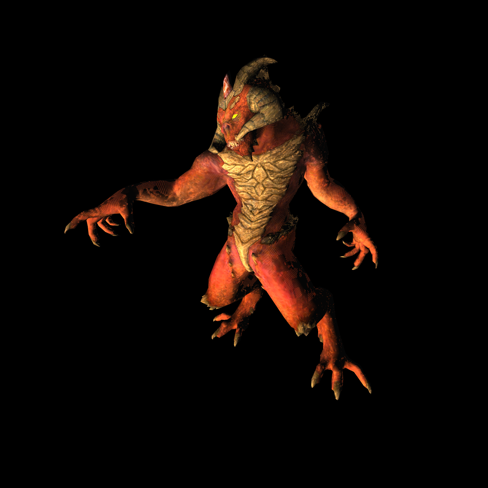
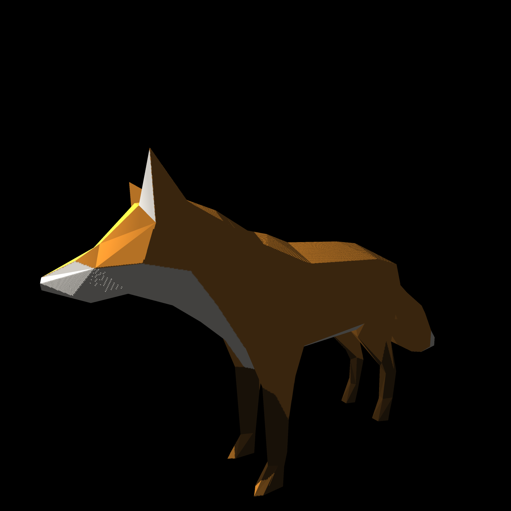

## Todo

thanks to [tinyrender](https://github.com/ssloy/tinyrenderer), I have learned a lot from it. At the same time, I also made a lot of changes.

- [ ] Mipmap
- [x] MVP Transformation
- [x] MSAA
- [x] bilinear interpolation
- [x] shadow map

## 1. Transformation

### 1.1 Model Transformation

You can rotate your model around y-axis now, and you can also scale or translate your model. but remenber that the model file in obj format is in the cube $[-1, 1]^{3}$.

```cpp
void set_model_mat(const float &angle, const Vec3f& scale, const Vec3f& translate);
```

**you can add rotation around any axis!**

### 1.2 View Transformation

You can set the position of the camera, the direction of the camera, and the direction of the camera up. But remember that the direction of the camera and the direction of the camera up must be orthogonal. It's not convenient that you can imporve it.

```cpp
void set_view_mat(Vec3f& camera_position, Vec3f& camera_dir, Vec3f& up);
```

### 1.3 Projection Transformation

You can set the closest distance and the farthest distance you can see. And you also can set vertical field of view and aspect radio.

```cpp
void set_projection_matrix(const float& eye_fov, const float& aspect_ratio, const float& zNear, const float& zFar);
```


## 2. MSAA

We oversample each pixel four times, record the color value obtained from each oversampling, and the z-buffer is also four times the original one, and finally average the colors obtained from the four oversamplings.

```cpp
std::vector<std::vector<float>> offset = {{0.25f, 0.25f}, {0.25f, 0.75f}, {0.75f, 0.25f}, {0.75f, 0.75f}};

    for (P.x = bboxmin.x; P.x <= bboxmax.x; P.x++) {
        for (P.y = bboxmin.y; P.y <= bboxmax.y; P.y++) {
            int cnt = 0;
            int index = 0;
            int No = P.x + P.y * image.get_width();
            for (auto& vec : offset) {
                Vec3f c =
                    barycentric(proj<2>(pts[0]), proj<2>(pts[1]), proj<2>(pts[2]), Vec2f(P.x + vec[0], P.y + vec[1]));
                float alpha = c.x / pts[0][3], beta = c.y / pts[1][3], gamma = c.z / pts[2][3];
                float z_interpolated = 1 / (alpha + beta + gamma);
                if (c.x >= 0 && c.y >= 0 && c.z >= 0 && z_interpolated <= sample_list[No][index]) {
                    ++cnt;
                    bool discard = shader.fragment(Vec3f(alpha, beta, gamma), color);
                    if (!discard) {
                        sample_list[No][index] = z_interpolated;
                        sample_list_color[No][index] = color;
                    }
                }
                ++index;
            }

            if (cnt) {
                float z_interpolated_result = 0;
                Vec4f result;
                TGAColor color_result;

                for (auto& v : sample_list[No]) {
                    z_interpolated_result += v;
                }
                float z_interpolated_grayscale = (z_interpolated_result / 4.f - near) / (far - near) * 255.f;
                zbuffer.set(P.x, P.y, TGAColor(z_interpolated_grayscale));

                // Average the color of four supersampled points!
                for (auto& v : sample_list_color[No]) {
                    result[0] += v[0];
                    result[1] += v[1];
                    result[2] += v[2];
                    result[3] += v[3];
                }
                // It is not **color_result = TGAColor(result[0]/4, result[1]/4, result[2]/4, result[3]/4)**.
                color_result = TGAColor(result[2] / 4, result[1] / 4, result[0] / 4, result[3] / 4);
                image.set(P.x, P.y, color_result);
            }
        }
    }
```


## 3. phong shading




## 4. bump mapping


## 5. shadow mapping



